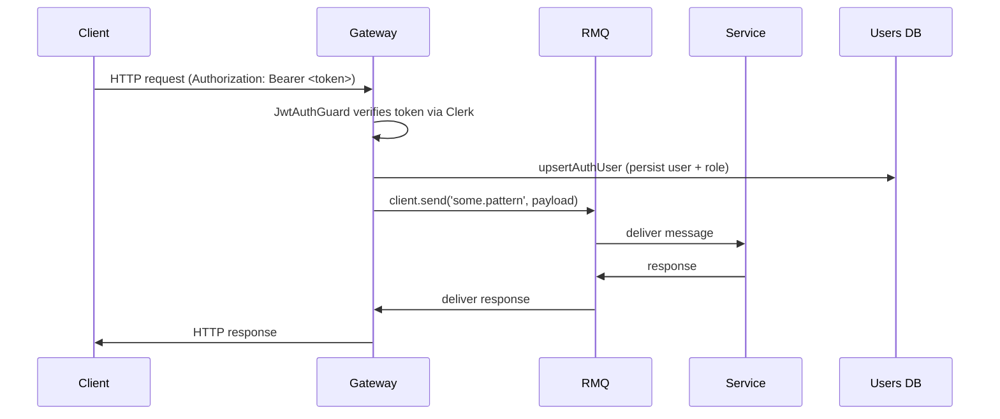

# Learn NestJS Microservices: Zero → Hero

This guide explains backend concepts, design decisions, and a file-by-file walkthrough of this repository so you can understand the logic from first principles up to the concrete code.

Use this doc while exploring the codebase: each project file referenced links back to the source so you can jump to lines while learning.

**Goal:** teach Nest core concepts, microservices patterns, RabbitMQ integration, authentication flow (Clerk), and how the gateway coordinates services.

---

**1. Big picture: architecture & data flow**
- The repository is a monorepo with multiple Nest apps under `apps/` (gateway, catalog, search, media).
- The **Gateway** is an HTTP server that:
  - validates user requests (auth)
  - exposes HTTP routes for clients
  - uses RabbitMQ (ClientProxy) to send RPC requests to microservices
- Microservices listen on message queues and respond to RPC calls from the gateway.

Sequence (simplified):



---

**2. Core Nest concepts (quick primer)**
- `Module`: grouping of related providers/controllers; organizes the app and controls DI scope. See `apps/gateway/src/gateway.module.ts`.
- `Controller`: maps HTTP routes to handler functions. See `apps/gateway/src/gateway.controller.ts`.
- `Service` (provider): injectable class that contains business logic. See `apps/gateway/src/gateway.service.ts`.
- Dependency Injection: Nest injects providers into constructors using the `@Injectable()` and registration in `Module.providers`.
- `Guard`: runs before route handler; used for auth/authorization. See `apps/gateway/src/auth/jwt-auth-guard.ts`.
- `Decorator`: meta helpers (`@Public()`, `@AdminOnly()`, `@CurrentUser()`) that attach metadata or extract request data.

---

**3. Microservices & RabbitMQ basics**
- Two common approaches: HTTP and message-based (RPC or events). This repo uses RPC over RabbitMQ.
- Gateway config registers `ClientsModule.register([...])` with `Transport.RMQ` to create `ClientProxy` instances (see [gateway.module.ts](apps/gateway/src/gateway.module.ts#L1-L57)).
- `ClientProxy.send(pattern, payload)` sends an RPC message; handlers in microservices use `@MessagePattern(pattern)` to implement the logic.

---

**4. Persistence: Mongoose (MongoDB)**
- Gateway imports `MongooseModule.forRoot(process.env['MongoDb-URL'])` (see [gateway.module.ts](apps/gateway/src/gateway.module.ts#L1-L57)).
- User records are upserted by `UsersService` so gateway can maintain roles/metadata used for authorization.

---

**5. Authentication: Clerk + token verification**
- The repo uses Clerk for authentication. The server receives a Bearer token and verifies it using Clerk's `verifyToken` from `@clerk/backend`.
- Key file: [apps/gateway/src/auth/auth.service.ts](apps/gateway/src/auth/auth.service.ts#L1-L111). Responsibilities:
  - Verify the token via `verifyToken(token, { secretKey: process.env.CLERK_SECRET_KEY })`.
  - Extract `sub` or `userId` from token payload.
  - If token includes name/email, build the `UserContext` from token; otherwise call `this.clerk.users.getUser(clerkUserId)` to fetch user details.

Important: the server must use `CLERK_SECRET_KEY` (server key starting with `sk_`) — not the publishable key.

---

**6. Code walkthrough — file by file**

- **`apps/gateway/src/main.ts`** — app bootstrap. Steps:
  - set `process.title = 'gateway'`
  - create Nest app with `GatewayModule`
  - enable shutdown hooks and listen on `process.env.GATEWAY_PORT ?? 5000` ([main.ts](apps/gateway/src/main.ts#L1-L17)).

- **`apps/gateway/src/gateway.module.ts`** — wire-up:
  - `ConfigModule.forRoot({ isGlobal: true })` to load `.env` globally.
  - `MongooseModule.forRoot(process.env['MongoDb-URL'])` to connect to MongoDB.
  - register RMQ clients for catalog/search/media via `ClientsModule.register([...])` (see file [gateway.module.ts](apps/gateway/src/gateway.module.ts#L1-L57)).

- **`apps/gateway/src/gateway.controller.ts`** — example endpoint `/health`:
  - Demonstrates use of `ClientProxy` and `firstValueFrom(client.send(...))` to await responses from microservices.
  - Uses `@Public()` so `JwtAuthGuard` allows unauthenticated access to `/health` ([gateway.controller.ts](apps/gateway/src/gateway.controller.ts#L1-L59)).

- **`apps/gateway/src/gateway.service.ts`** — tiny example provider with `getHello()`.

- **Auth files** (best read in sequence):
  - `auth.module.ts` — registers `AuthService`, `AuthController`, and mounts global `JwtAuthGuard` via `APP_GUARD`. See [auth.module.ts](apps/gateway/src/auth/auth.module.ts#L1-L21).
  - `auth.service.ts` — Clerk verification & user context builder. See [auth.service.ts](apps/gateway/src/auth/auth.service.ts#L1-L111).
  - `jwt-auth-guard.ts` — full guard that:
    1. checks `@Public()` metadata and skips if public;
    2. reads `Authorization` header and extracts `Bearer` token;
    3. calls `AuthService.verifyAndBuildContext(token)`;
    4. upserts user via `UsersService.upsertAuthUser(...)` and attaches `req.user` for downstream handlers;
    5. enforces admin role when `@AdminOnly()` is present. See [jwt-auth-guard.ts](apps/gateway/src/auth/jwt-auth-guard.ts#L1-L88).
  - `auth.controller.ts` — returns `GET /auth/me` using `@CurrentUser()` to access `req.user` ([auth.controller.ts](apps/gateway/src/auth/auth.controller.ts#L1-L15)).
  - `current-user-decorator.ts`, `public.decorater.ts`, `admin.decorator.ts`, `auth.types.ts` — utilities for metadata and types.

---

**7. Request lifecycle example: GET /some-protected-route**
1. Client sends `GET /resource` with `Authorization: Bearer <token>`.
2. Nest calls `JwtAuthGuard.canActivate()`:
   - verifies token → obtains `UserContext`
   - upserts user in DB and attaches `req.user`
   - checks `@AdminOnly()` if present
3. Controller handler runs and may call microservice via `this.someClient.send('pattern', payload)`.
4. Response returned after microservice reply.

---

**8. Environment & local run checklist**
- Ensure `.env` has correct keys:
  - `CLERK_SECRET_KEY` (server key)
  - `RABBITMQ_URL` (e.g. `amqp://localhost:5672`)
  - `MongoDb-URL`
- Start RabbitMQ locally (or use a cloud instance) before starting services.
- Commands:
  ```bash
  cd nestjs-microservices
  npm install
  npm run start:dev
  # or start a single app
  npx nest start gateway --watch
  ```

---

**9. Debugging tips**
- Token errors: copy the full Clerk user id (no truncation). If you see `user_3Hm1…WrU18lSFy` that's truncated.
- To inspect the token payload locally, print decoded payload used by `verifyToken` in `AuthService.verifyAndBuildContext` during development.
- To troubleshoot RMQ / client.send: ensure `queue` names match and RabbitMQ is reachable.

---

**10. Suggested learning path (practical steps)**
1. Read `apps/gateway/src/main.ts` and `gateway.module.ts` to understand bootstrap and config.
2. Trace `GET /health` in `gateway.controller.ts` to learn RPC calls via `ClientProxy`.
3. Walk through `AuthService.verifyAndBuildContext` to understand Clerk token verification.
4. Follow `JwtAuthGuard` code to learn how request context and roles are assigned.
5. Run the gateway and call `/auth/me` with a valid token to see the full flow.

---

If you want, I can now:
- generate an annotated version of a specific file with inline comments explaining each block;
- or create a set of small exercises (run + modify) to reinforce each concept.

Pick one file to annotate next (suggestion: `apps/gateway/src/auth/auth.service.ts`).
