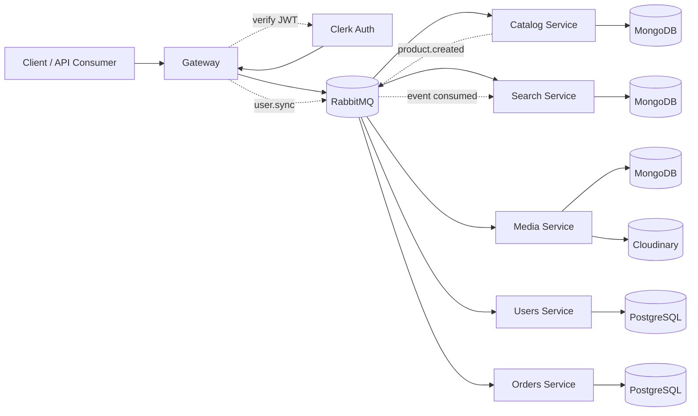

# NestJS Microservices E-Commerce

This repository is a NestJS microservices monorepo for an e-commerce-style system. It uses RabbitMQ for service-to-service messaging, MongoDB and PostgreSQL for persistence, Clerk for authentication, and Cloudinary for media storage.

The system is organized around a gateway plus focused domain services:
- `gateway` handles HTTP traffic, authentication, and orchestration
- `catalog` owns product data
- `search` maintains a read-optimized product index
- `media` handles image upload and attachment
- `users` syncs authenticated Clerk users into PostgreSQL
- `orders` owns order persistence and lookup

## Architecture



## Services

### Gateway

The gateway is the public HTTP entry point.

Responsibilities:
- JWT authentication with Clerk
- Role-aware access control
- Authenticated user sync through the users service
- HTTP-to-RMQ routing
- Health checks for downstream services

### Auth

Auth lives in the gateway and uses Clerk JWTs to identify the current user before protected requests reach controllers.

Responsibilities:
- Verify Bearer tokens with Clerk
- Build the request user context
- Sync the authenticated user to the users service with `user.sync`
- Read the stored PostgreSQL role from users and apply admin-only route checks

### Catalog

The catalog service owns product persistence and publishes product-created events after a successful write.

Responsibilities:
- Create and list products
- Fetch a product by ID
- Validate product payloads
- Emit `product.created` after product creation

### Search

The search service consumes catalog events and maintains a queryable index document.

Responsibilities:
- Consume `product.created`
- Upsert search documents in MongoDB
- Query products by keyword

### Media

The media service stores uploaded product images in Cloudinary and tracks media metadata in MongoDB.

Responsibilities:
- Upload images
- Attach media to products
- Persist media metadata

### Users

The users service stores Clerk-authenticated user records in PostgreSQL so domain services can rely on a local user record.

Responsibilities:
- Sync users from Clerk context
- Create or update users by Clerk user ID
- Persist user profile and role data

### Orders

The orders service owns order persistence in PostgreSQL and exposes order operations over RMQ.

Responsibilities:
- Create orders for authenticated users
- List orders
- Fetch an order by ID

## Messaging Flow

### Request/response

The gateway uses RMQ request/response for client-facing operations such as:
- `product.create`
- `product.list`
- `product.getById`
- `search.query`
- `user.sync`
- `order.create`
- `order.list`
- `order.getById`

### Auth and users

For protected HTTP routes, the gateway auth guard verifies the Clerk JWT, builds a user context, and sends `user.sync` to the users service.
The users service creates or updates the user in PostgreSQL and returns the stored user, including the role used by gateway admin checks.

### Event-driven updates

The catalog service emits `product.created` as a one-way event.
The search service listens for that event and updates its index document.

## Auth API

The gateway exposes:

```http
GET /auth/me
```

Protected routes require an `Authorization: Bearer <token>` header.
Routes marked with the `Public` decorator skip Clerk verification.

## Search API

The gateway exposes:

```http
GET /search?q=eva
GET /search?q=eva&limit=10
```

Important:
- `q` is required
- `limit` is optional
- a request without `q` returns a validation error

## Product API

Typical gateway product endpoints:

- `POST /products`
- `GET /products`
- `GET /products/:id`

The exact request body is validated by the gateway before it is forwarded to catalog.

## Order API

Typical gateway order endpoints:

- `POST /orders`
- `GET /orders`
- `GET /orders/:id`

The gateway attaches the authenticated Clerk user ID before forwarding order creation to the orders service.

## Environment Variables

Create a `.env` file in the repository root.

Common variables used by the apps:

- `GATEWAY_PORT`
- `RABBITMQ_URL`
- `CATALOG_QUEUE`
- `SEARCH_QUEUE`
- `MEDIA_QUEUE`
- `USERS_QUEUE`
- `ORDERS_QUEUE`
- `CATALOG_TCP_PORT`
- `SEARCH_TCP_PORT`
- `MEDIA_TCP_PORT`
- `PUBLIC_PUBLISHABLE_KEY`
- `CLERK_SECRET_KEY`

MongoDB variables supported by the current code:

- `MongoDb-URL-Users`
- `MongoDb-URL-Catalog`
- `MongoDb-URL-SEARCH`
- `MongoDb-URL-MEDIA`

PostgreSQL variables used by `users` and `orders`:

- `POSTGRES_HOST`
- `POSTGRES_PORT`
- `POSTGRES_USER`
- `POSTGRES_PASSWORD`
- `POSTGRES_DB`

Cloudinary variables:

- `CLOUDINARY_URL`
- `CLOUDINARY_API_KEY`
- `CLOUDINARY_CLOUD_NAME`
- `CLOUDINARY_API_SECRET`

Notes:
- The repo currently supports both `MongoDb-URL-*` and some `MONGO_*` fallbacks in code.
- If you run services locally, the fallback MongoDB URIs point to `localhost`.

## Local Development

Install dependencies:

```bash
npm install
```

Run the full workspace in dev mode:

```bash
npm run start:dev
```

Run a single service:

```bash
npx nest start gateway --watch
npx nest start catalog --watch
npx nest start search --watch
npx nest start media --watch
npx nest start users --watch
npx nest start orders --watch
```

Build the project:

```bash
npm run build
```

## Docker

The repository includes a `docker-compose.yml` for RabbitMQ, MongoDB, PostgreSQL, and service startup.

## Validation and Error Handling

The codebase uses:
- DTO validation for inbound payloads
- service-level guards for domain rules
- RPC exception mapping for predictable HTTP responses
<!-- 
## Current Implementation Notes

- Product creation in catalog emits `product.created`
- Search consumes that event and maintains its own MongoDB collection
- Gateway search requests must include `q`
- The gateway uses Clerk-protected routes with public endpoints marked by the `Public` decorator -->
