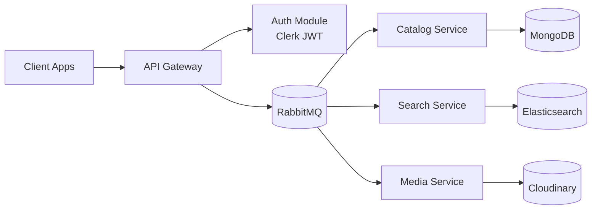

# E-commerce Microservices (NestJS)

Production-style microservices monorepo built with NestJS, RabbitMQ, MongoDB, and Clerk authentication. The system is split into focused services behind one API Gateway so features can scale independently.

## Core Capabilities

- Microservices architecture with modular service boundaries
- API Gateway as the central HTTP entry point
- Clerk JWT authentication with guards and custom decorators
- Catalog service for product CRUD with MongoDB
- Search service for indexing and fast product discovery (Elasticsearch-oriented flow)
- Media service for uploads and external image storage (Cloudinary-oriented flow)
- RabbitMQ message broker with RPC-based communication
- Inter-service communication using async messaging and request-response patterns
- DTO validation and explicit error mapping at service boundaries
- Health checks, logs, and reliability-focused design

## High-Level Architecture



## Services

### 1) API Gateway

Responsibilities:
- Central entry point for external clients
- Authentication and authorization enforcement
- Route orchestration to internal services over RabbitMQ
- Health endpoint that verifies downstream service availability

Main files:
- apps/gateway/src/main.ts
- apps/gateway/src/gateway.module.ts
- apps/gateway/src/gateway.controller.ts
- apps/gateway/src/auth/*

### 2) Catalog Service

Responsibilities:
- Product create/read/update/delete operations
- Product data ownership and persistence logic
- Service-level validation and domain error handling

Main files:
- apps/catalog/src/main.ts
- apps/catalog/src/catalog.controller.ts
- apps/catalog/src/catalog.service.ts
- apps/catalog/src/catalog.module.ts

### 3) Search Service

Responsibilities:
- Search index management and synchronization workflow
- Query APIs for fast keyword/product retrieval
- Read-optimized model for discovery experiences

Main files:
- apps/search/src/main.ts
- apps/search/src/search.controller.ts
- apps/search/src/search.service.ts
- apps/search/src/search.module.ts

### 4) Media Service

Responsibilities:
- File upload handling
- Media metadata management
- External image storage integration flow (Cloudinary-oriented)

Main files:
- apps/media/src/main.ts
- apps/media/src/media.controller.ts
- apps/media/src/media.service.ts
- apps/media/src/media.module.ts

## Authentication and Authorization

The Gateway applies authentication globally using a JWT guard and custom decorators.

Flow:
1. Client sends Bearer token to Gateway
2. Guard verifies token with Clerk server SDK
3. Request user context is attached to the request
4. Local user record is upserted for role and profile consistency
5. Route-level decorators enforce public/admin access rules

Key auth files:
- apps/gateway/src/auth/auth.service.ts
- apps/gateway/src/auth/jwt-auth-guard.ts
- apps/gateway/src/auth/current-user-decorator.ts
- apps/gateway/src/auth/public.decorater.ts
- apps/gateway/src/auth/admin.decorator.ts

## Messaging and RPC

RabbitMQ is used as the transport layer between Gateway and domain services.

Patterns used:
- RPC request-response for immediate client-facing operations
- Async message-based integration for decoupled service workflows

Queues are configured via environment variables:
- CATALOG_QUEUE
- SEARCH_QUEUE
- MEDIA_QUEUE

## Validation and Error Strategy

- DTO-based payload validation at API boundaries
- Consistent exception mapping for predictable client responses
- Service-layer checks to avoid leaking infrastructure-level errors

## Health, Logs, and Reliability

Reliability layer includes:
- Gateway health checks for downstream services
- Structured logs across service startup and message handling
- Clear service boundaries that reduce blast radius during failures
- Queue-based communication that supports loose coupling and resiliency

## Project Structure

```text
apps/
	gateway/
	catalog/
	search/
	media/
```

## Environment Configuration

Create a .env file at repository root.

Required variables (example names):
- GATEWAY_PORT (code also has fallback patterns)
- RABBITMQ_URL
- CATALOG_QUEUE
- SEARCH_QUEUE
- MEDIA_QUEUE
- CLERK_SECRET_KEY
- PUBLIC_PUBLISHABLE_KEY
- MongoDb-URL

Optional service-specific variables:
- Elasticsearch connection variables for search indexing
- Cloudinary variables for media upload/storage

Important:
- Never commit real secrets to Git history.
- Rotate keys immediately if they were exposed.

## Local Development

Install dependencies:

```bash
npm install
```

Run all services in watch mode:

```bash
npm run start:dev
```

Run individual apps:

```bash
npx nest start gateway --watch
npx nest start catalog --watch
npx nest start search --watch
npx nest start media --watch
```

Run tests:

```bash
npm run test
npm run test:e2e
```

## Suggested Next Improvements

- Add shared contracts package for DTO/event schemas
- Add dead-letter queues and retry policies per service
- Add OpenTelemetry traces across Gateway and services
- Add centralized config validation and secret management
- Add CI pipeline with lint, test, and smoke checks
